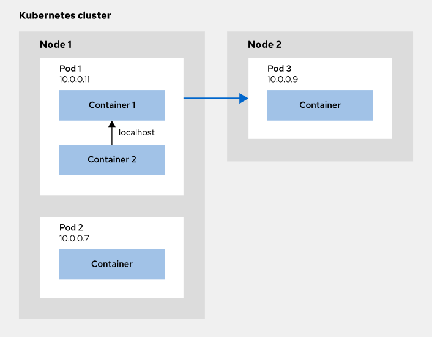
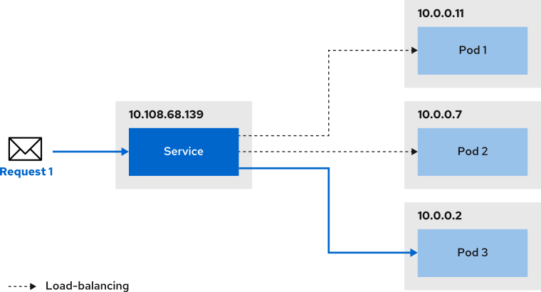

# Kubernetes guide

Author: Pedro Pablo Silva Antilef
Based on: [kubebyexample.com Kubernetes guide](https://kubebyexample.com/learning-paths/application-development-kubernetes)

## Introducction to Kubernetes

Kubernetes (also called k8s) manages a highly available cluster of computers, working as a single unit. It allows you to deploy containerized applications across the cluster without binding them to specific machines. Applications must be containerized to leverage this model, offering greater flexibility and availability compared to traditional deployment methods where apps were tightly integrated into individual hosts. Kubernetes automates container distribution and scheduling efficiently. It is an open-source, production-ready platform.

A Kubernetes cluster has two main components:

- Control Plane: Manages and coordinates the cluster.

- Nodes: Worker machines that run applications.

## Start a cluster

To start a cluster there is several options based on the level of knowledge about kubernetes. For locally setup, you can use Docker Desktop, Rancher (alternative to Docker Desktop), minikube (for easy learning and dev with k8s) and kubeadm if you want a deeper control of the cluster configuration.

Here is the link to [installation minikube tutorial](https://minikube.sigs.k8s.io/docs/start/?arch=%2Fmacos%2Farm64%2Fstable%2Fbinary+download) and the [official documentation of minikube](https://kubernetes.io/docs/tutorials/hello-minikube/).

with this you can manage you kubernetes cluster using this simple commands:

Pause Kubernetes without impacting deployed applications:

```bash
minikube pause
```

Unpause a paused instance:

```bash
minikube unpause
```

Halt the cluster:

```bash
minikube stop
```

Delete all of the minikube clusters:

```bash
minikube delete --all
```

## Kubernetes basics

to get the version of kubernetes run:

```bash
kubectl version
```

if you want to know how the cluster was created, run:

```bash
kubectl config get-contexts
```

to get the information about the cluster, run:

```bash
kubectl cluster-info
```

view cluster configuration file located in .kube folder in home:

```bash
kubectl config view
```

view cluster events:

```bash
kubectl get events --sort-by='.lastTimestamp'
```

to get the list of nodes:

```bash
kubectl get nodes
```

to get the list of pods of all namespaces:

```bash
kubectl get pods -A
```

to delet all the pods in a specific namespace:

```bash
kubectl delete --all deployments --namespace=foo 
```

to get a list of namespaces (a namespace is a way to organize clusters into virtual sub-clusters):

```bash
kubectl get namespaces
```

## Configuring the cluster

To create a new cluster connection run this command:

```bash
kubectl config set-cluster my-cluster --server=127.0.0.1:8087
```

To connect to the cluster, it is necessary to provide an authentication method. There are several options to authenticate with the cluster:

Using a token:

```bash
kubectl config set-credentials my-user --token=Py93bt12mT
```

Using basic authentication:

```bash
kubectl config set-credentials my-user --username=your-username --password=yout-password
```

Using a certificate:

```bash
kubectl config set-credentials my-user --client-certificate=my-certificate.crt --client-key=my-key.key
```

A context is a collection of access parameters that defines how to connect to a specific cluster.

To create a new context:

```bash
kubectl config set-context --cluster=my-cluster --user=my-user
```

A namespace is a way to organize clusters into virtual sub-clusters. You can create a namespace using this:

```bash
kubectl create namespace my-namespace-name
```

In a kubectl context, it is possible to set a namespace. If provided, then any command would be executed in that namespace. The following command creates a context that points to the namespace.

```bash
kubectl config set-context my-context --cluster=my-cluster --user=my-user --namespace=redhat-dev
```

or simply run this commando to point the current context to your namespace:

```bash
kubectl config set-context --current --namespace=my-namespace
```

You can select a context by running:

```bash
kubectl config use-context my-context
```

## Creating a Deployment

A Kubernetes pod is a group of one or more Containers, sharing administration and networking. In this tutorial, the Pod contains a single Container. A Kubernetes Deployment monitors the Pod's health and restarts its Container if it fails. Deployments are the preferred method for managing Pod creation and scaling.

Use kubectl create deployment to deploy con

```bash
kubectl create deployment deployment-name --image image --replicas=3
```

To see the manifest of a specific deployment, run:

```bash
kubectl get deployment deployment-name -o yaml
```

if you want to edit the manifest, you can run this command:

```bash
kubectl edit deployment deployment-name
```

to scale a deployment (replace deployment-name and n):

```bash
kubectl scale deployment deployment-name --replicas=n
```

get the log of a specific deployment by his id:

```bash
kubectl logs node-id
```

## Kubernetes services: networking

when a pods are created, they are assigned and IP address. This IP allow you to access to pods from everywhere within de Kubernetes Cluster. Pods and containers inside of the pods share the same network, so container in the same pod can communicate beetwen the localhost address.



deployment is something of every day in Kubernetes. When features are added or bug is fixed, a new image version is created and deployed, so pods are constantly created and destroyed.

Usually applications have several replicas, and the traffic is balanced across this replicas to ensure a good traffic balance (load-balancing).

In either case, you need a way to reach the pods and containers regardless of the node that they are llocated.

A **Service** in Kubernetes provides reliable access to a group of Pods, abstracting their private IPs. Instead of accessing Pods directly, a Service targets Pods based on criteria like labels and forwards requests to them. It groups related Pods and ensures load balancing across them, enabling consistent and scalable access.



It is necesary to define a port when you are creating a service. This port is mapped to a target port that is inside of the pod that you are trying to access.  If no target port is provided, then the port value is used.

There exist two ways to create a service:

- Using expose command:

```bash
kubectl expose deployment deployment-name --port=8081 --name=service-name --target-port=3000
```

now you can access to the list service using:

```bash
kubectl get service
```

- Using manifest
Following DevOps principles, services can be created using a manifest. For example, the manifest below creates a service named `nginx-service` that targets Pods with the label `app: nginx`. The service listens on port `8080` and forwards traffic to port `3000` on the Pods. Since the `type` field is omitted, the service defaults to ClusterIP.

```docker-compose
apiVersion: v1
kind: Service
metadata:
  name: nginx-service (1)
spec:
  selector: (2)
    app: nginx
  ports: (3)
    - protocol: TCP
      port: 8081 (4)
      targetPort: 3000 (5)
```


1. Name of the service

2. Labels used to select the target pods

3. Port mapping

4. The port that the service will serve on

5. The port inside the pod where requests are forwarded

If you need to expose your service, here is a example:

```bash
apiVersion: v1
kind: Service
metadata:
  name: influxdb2
spec:
  ports:
    - name: influxdb2
      protocol: TCP
      port: 7086
      targetPort: 8086
      nodePort: 32321
  type: NodePort
  selector:
    app: influxdb2
```

and you should be able to enter in this URL:

```bash
http://localhost:32321/
```


## Using secrets with Kubernetes

This part of the guide was extracted from [spacelift](https://spacelift.io/blog/kubernetes-secrets)

If you need to use secrets on your app, generate your passowrd encrypted by base64:


```bash
echo -n 'admin' | base64
echo -n 'my-password' | base64
```

then, put the result in a secret.yaml file

```bash
apiVersion: v1
kind: Secret
metadata:
  name: my-secret
type: Opaque
data:
  username: YWRtaW4=
  password: bXktcGFzc3dvcmQ=
```

then run this commando to create the secret based on secret.yaml file. Remember that the secrets are associate to a specific namespace:

```bash
kubectl -n my-namespace apply -f my-secret.yaml
```

To see the secret use this command. Replace my-secret with the name of your my-secret.yaml file:

```bash
kubectl -n my-namespace describe secrets/my-secret
```

This will give you just the numers of bytes, but if you need to actually see the data, run this command:

```bash
kubectl -n my-namespace get secret my-secret -o jsonpath='{.data}'
```

and if you need to decode the output string, run this:

```bash
echo 'YWRtaW4=' | base64 --decode
echo 'cGFzc3dvcmQ=' | base64 --decode
```

edit cretendials:

```bash
kubectl -n secrets-demo edit secrets database-credentials
```

delete secret:

```bash
kubectl delete secret my-secret -n my-namespace
```


This is an example of a pod manifest using secrets:

```bash
apiVersion: v1
kind: Pod
metadata:
  name: env-pod
spec:
  containers:
    - name: secret-test
      image: nginx
      command: ['sh', '-c', 'echo "Username: $USER" "Password: $PASSWORD"']
      env:
        - name: USER
          valueFrom:
            secretKeyRef:
              name: database-credentials
              key: username.txt
        - name: PASSWORD
          valueFrom:
            secretKeyRef:
              name: database-credentials
              key: password.txt
```

### Deploy your app

When you already create your manifest file with your deployment and service, then just run the following command:

```bash
kubectl apply -f deploy/deployment.yml
```

If you need to enter to a container inside of a pod, just run:

```bash
kubectl exec -n namespacename pod-name -it -- /bin/sh
```

to delete all resources in a namespace:

```bash
kubectl delete all -n <namespace-name> --all
```

## Docker-compose migration to Kubernetes

This guide is based on the [official documentation](https://kubernetes.io/docs/tasks/configure-pod-container/translate-compose-kubernetes/). Komposer is a tool that allow you to convert a docker-compose file into a several kubernetes manifests. Maybe will not be a perfect conversion, but definitely will save you time.

You need to have a Kubernetes cluster, and the kubectl command-line tool must be configured to communicate with your cluster.

Then is need to install Kompose, a conversion tool for all things compose to container orchestrators.

for MacOS:

```bash
brew install kompose
```

To convert the docker-compose.yml file to files that you can use with kubectl, run kompose convert and then kubectl apply -f output file.

```bash
kompose convert
```

or to create a Chart to be used with Helm

```bash
kompose convert -c
```

and then run the manifest that was created in previous step. Replace the current yamls with your owns manifest files.

```bash
 kubectl apply -f web-tcp-service.yaml,redis-leader-service.yaml,redis-replica-service.yaml,web-deployment.yaml,redis-leader-deployment.yaml,redis-replica-deployment.yaml
```